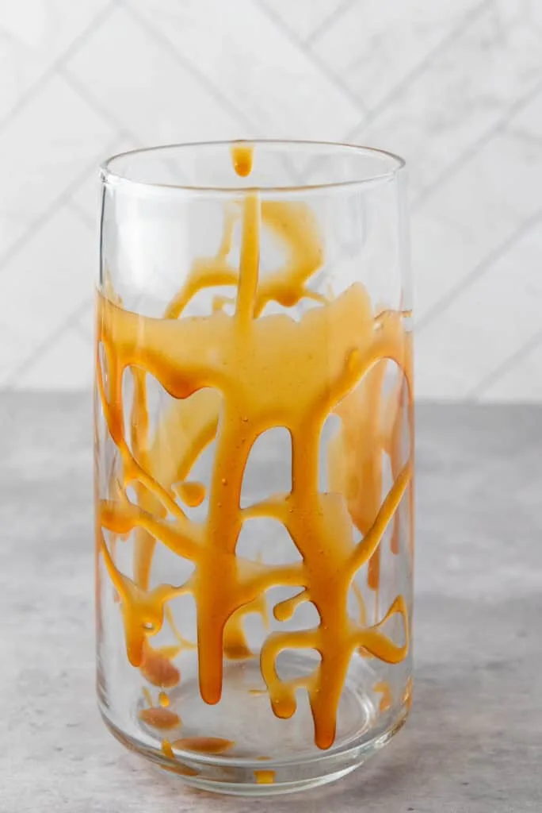
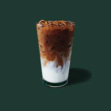

# How To Make a Venti Iced Caramel Macchiato

A Caramel Macchiato is a layered coffee drink made with espresso, milk, vanilla syrup, and caramel drizzle, it offers sweet and creamy flavor as well as a strong coffee kick. 

### WARNING: You will be using steaming liquids that can cause severe burns.

## Ingredients:
- Milk (Any kind works)
- Espresso Shots
- Vanilla Syrup
- Caramel Drizzle
- Ice

## Equipment:
- Espresso Machine
- Shot Glass
- Ice scooper

## Steps

1. Preparaing the Cup:

   - Drizzle the Caramel sause around the venti cup and let it slide down the cup. It should look something like the following picture.

   > 

2. Adding Vanilla Syrup:

   - Now you will add 4 pumps of vanilla syrup to the cup.
     > If the vanilla syrup container does not have a pump, add around 2oz of vanilla syrup.
    
3. Adding Milk:

   - Pour around 16-20 oz of milk into the cup depending on how much ice you want in your beverage.
     > Any sort of milk should work for this step, so choose your favorite.

4. Brewing Coffee:

   - Brew 3 shots of espresso using an espresso machine. The espresso shots should be freshly brewed and hot.

5. Adding Ice:

   - Add ice to the cup until you have about 1-2 inches of space left on the cup.

6. Check the Shots:

   - Check the shots that you have made previously to ensure that they are a deep rich brown color with a thick golden crema on top. They should look like the following picture. 
  
      > 

7. Pour the Shots:

   - Slowly pour the freshly brewed espresso shots directly into the center of the glass. This will create a layered effect with the espresso sitting on top of the milk.

8. Drizzle the Caramel Sauce:

   - Finish the drink by drizzling caramel sauce over the top of the drink in a crosshatch pattern for that classic Starbucks touch.

## Enjoy Your Caramel Macchiato!!!

 > 
   
